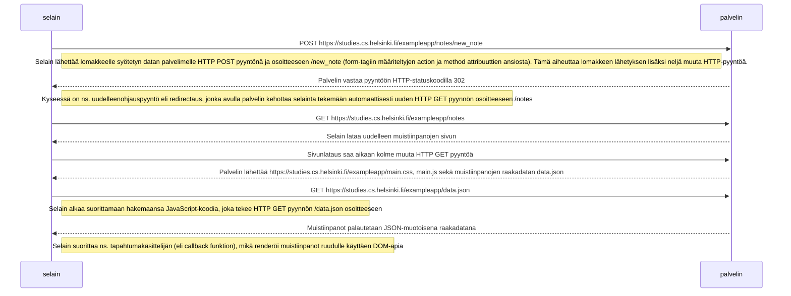

```mermaid
sequenceDiagram
    participant selain
    participant palvelin
    
    selain->>palvelin: POST https://studies.cs.helsinki.fi/exampleapp/notes/new_note

Note right of selain: Selain lähettää lomakkeelle syötetyn datan palvelimelle HTTP POST pyyntönä ja osoitteeseen /new_note (form-tagiin määriteltyjen action ja method attribuuttien ansiosta). Tämä aiheuttaa lomakkeen lähetyksen lisäksi neljä muuta HTTP-pyyntöä.

    activate palvelin
    palvelin-->>selain: Palvelin vastaa pyyntöön HTTP-statuskoodilla 302

Note right of selain: Kyseessä on ns. uudelleenohjauspyyntö eli redirectaus, jonka avulla palvelin kehottaa selainta tekemään automaattisesti uuden HTTP GET pyynnön osoitteeseen /notes

    selain->>palvelin: GET https://studies.cs.helsinki.fi/exampleapp/notes
    activate palvelin
    palvelin-->>selain: Selain lataa uudelleen muistiinpanojen sivun
    
    selain->>palvelin: Sivunlataus saa aikaan kolme muuta HTTP GET pyyntöä
    activate palvelin
    palvelin-->>selain: Palvelin lähettää https://studies.cs.helsinki.fi/exampleapp/main.css, main.js sekä muistiinpanojen raakadatan data.json
 
    selain->>palvelin: GET https://studies.cs.helsinki.fi/exampleapp/data.json
Note right of selain: Selain alkaa suorittamaan hakemaansa JavaScript-koodia, joka tekee HTTP GET pyynnön /data.json osoitteeseen
    activate palvelin
    palvelin-->>selain: Muistiinpanot palautetaan JSON-muotoisena raakadatana
     
Note right of selain: Selain suorittaa ns. tapahtumakäsittelijän (eli callback funktion), mikä renderöi muistiinpanot ruudulle käyttäen DOM-apia
```
