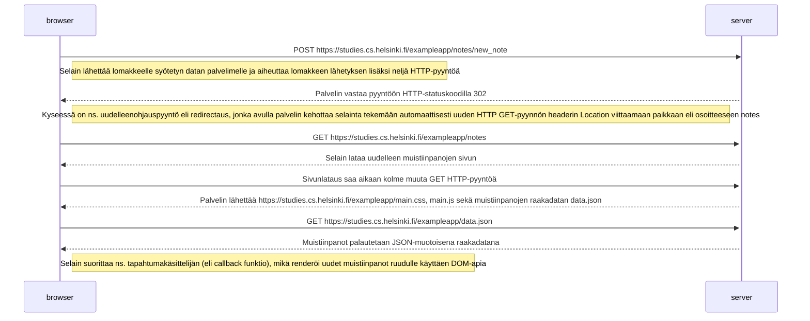

```mermaid
sequenceDiagram
    participant browser
    participant server
    
    browser->>server: POST https://studies.cs.helsinki.fi/exampleapp/notes/new_note

Note right of browser: Selain lähettää lomakkeelle syötetyn datan palvelimelle ja aiheuttaa lomakkeen lähetyksen lisäksi neljä HTTP-pyyntöä

    activate server
    server-->>browser: Palvelin vastaa pyyntöön HTTP-statuskoodilla 302

Note right of browser: Kyseessä on ns. uudelleenohjauspyyntö eli redirectaus, jonka avulla palvelin kehottaa selainta tekemään automaattisesti uuden HTTP GET‑pyynnön headerin Location viittaamaan paikkaan eli osoitteeseen notes

    browser->>server: GET https://studies.cs.helsinki.fi/exampleapp/notes
    activate server
    server-->>browser: Selain lataa uudelleen muistiinpanojen sivun
    
    browser->>server: Sivunlataus saa aikaan kolme muuta GET HTTP-pyyntöä
    activate server
    server-->>browser: Palvelin lähettää https://studies.cs.helsinki.fi/exampleapp/main.css, main.js sekä muistiinpanojen raakadatan data.json
 
    browser->>server: GET https://studies.cs.helsinki.fi/exampleapp/data.json
    activate server
    server-->>browser: Muistiinpanot palautetaan JSON-muotoisena raakadatana
     
Note right of browser: Selain suorittaa ns. tapahtumakäsittelijän (eli callback funktio), mikä renderöi uudet muistiinpanot ruudulle käyttäen DOM-apia
```
