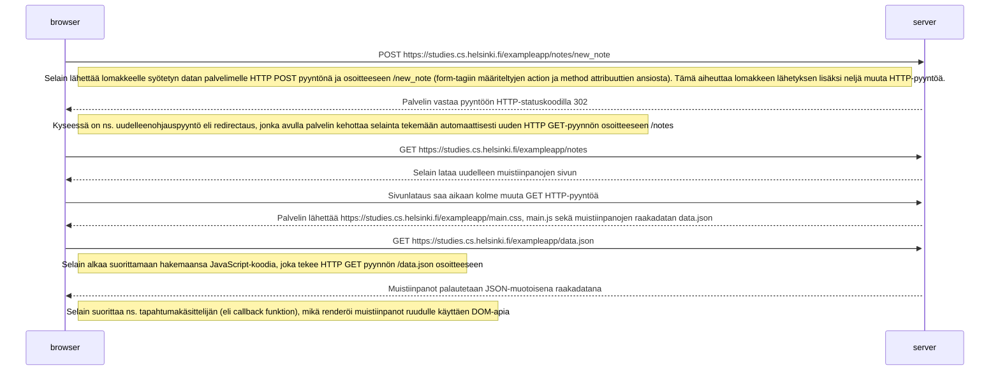

```mermaid
sequenceDiagram
    participant browser
    participant server
    
    browser->>server: POST https://studies.cs.helsinki.fi/exampleapp/notes/new_note

Note right of browser: Selain lähettää lomakkeelle syötetyn datan palvelimelle HTTP POST pyyntönä ja osoitteeseen /new_note (form-tagiin määriteltyjen action ja method attribuuttien ansiosta). Tämä aiheuttaa lomakkeen lähetyksen lisäksi neljä muuta HTTP-pyyntöä.

    activate server
    server-->>browser: Palvelin vastaa pyyntöön HTTP-statuskoodilla 302

Note right of browser: Kyseessä on ns. uudelleenohjauspyyntö eli redirectaus, jonka avulla palvelin kehottaa selainta tekemään automaattisesti uuden HTTP GET‑pyynnön osoitteeseen /notes

    browser->>server: GET https://studies.cs.helsinki.fi/exampleapp/notes
    activate server
    server-->>browser: Selain lataa uudelleen muistiinpanojen sivun
    
    browser->>server: Sivunlataus saa aikaan kolme muuta GET HTTP-pyyntöä
    activate server
    server-->>browser: Palvelin lähettää https://studies.cs.helsinki.fi/exampleapp/main.css, main.js sekä muistiinpanojen raakadatan data.json
 
    browser->>server: GET https://studies.cs.helsinki.fi/exampleapp/data.json
Note right of browser: Selain alkaa suorittamaan hakemaansa JavaScript-koodia, joka tekee HTTP GET pyynnön /data.json osoitteeseen
    activate server
    server-->>browser: Muistiinpanot palautetaan JSON-muotoisena raakadatana
     
Note right of browser: Selain suorittaa ns. tapahtumakäsittelijän (eli callback funktion), mikä renderöi muistiinpanot ruudulle käyttäen DOM-apia
```
