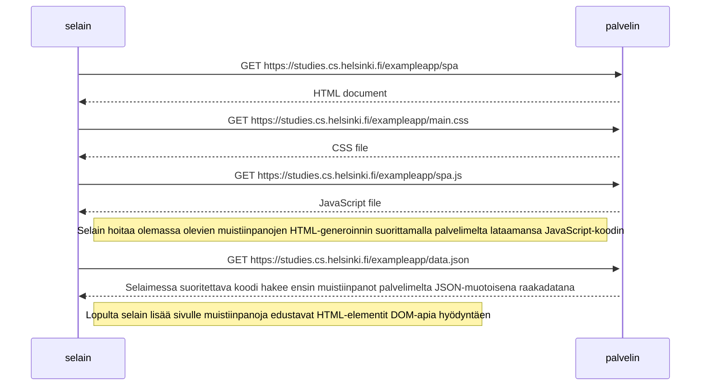

```mermaid
sequenceDiagram
    participant selain
    participant palvelin
    
    selain->>palvelin: GET https://studies.cs.helsinki.fi/exampleapp/spa
    activate palvelin
    palvelin-->>selain: HTML document
    
    
    selain->>palvelin: GET https://studies.cs.helsinki.fi/exampleapp/main.css
    activate palvelin
    palvelin-->>selain: CSS file

    
    selain->>palvelin: GET https://studies.cs.helsinki.fi/exampleapp/spa.js
    activate palvelin
    palvelin-->>selain: JavaScript file

    
    Note right of selain: Selain hoitaa olemassa olevien muistiinpanojen HTML-generoinnin suorittamalla palvelimelta lataamansa JavaScript-koodin
    
    selain->>palvelin: GET https://studies.cs.helsinki.fi/exampleapp/data.json
    activate palvelin
    palvelin-->>selain: Selaimessa suoritettava koodi hakee ensin muistiinpanot palvelimelta JSON-muotoisena raakadatana
   

    Note right of selain: Lopulta selain lisää sivulle muistiinpanoja edustavat HTML-elementit DOM-apia hyödyntäen

```
