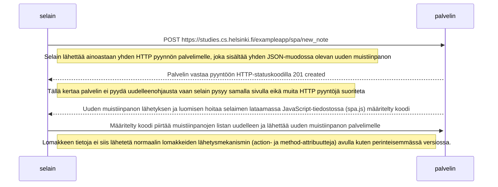

```mermaid
sequenceDiagram
    participant selain
    participant palvelin
    
    selain->>palvelin: POST https://studies.cs.helsinki.fi/exampleapp/spa/new_note

Note right of selain: Selain lähettää ainoastaan yhden HTTP pyynnön palvelimelle, joka sisältää yhden JSON-muodossa olevan uuden muistiinpanon

    activate palvelin
    palvelin-->>selain: Palvelin vastaa pyyntöön HTTP-statuskoodilla 201 created

Note right of selain: Tällä kertaa palvelin ei pyydä uudelleenohjausta vaan selain pysyy samalla sivulla eikä muita HTTP pyyntöjä suoriteta
    
 
    palvelin-->>selain: Uuden muistiinpanon lähetyksen ja luomisen hoitaa selaimen lataamassa JavaScript-tiedostossa (spa.js) määritelty koodi
    selain->>palvelin: Määritelty koodi piirtää muistiinpanojen listan uudelleen ja lähettää uuden muistiinpanon palvelimelle

Note right of selain: Lomakkeen tietoja ei siis lähetetä normaalin lomakkeiden lähetysmekanismin (action- ja method-attribuutteja) avulla kuten perinteisemmässä versiossa. 

  
```
